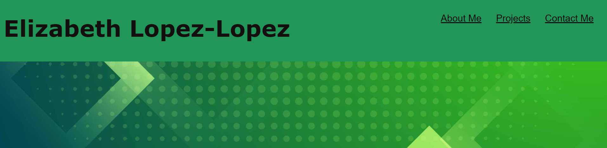
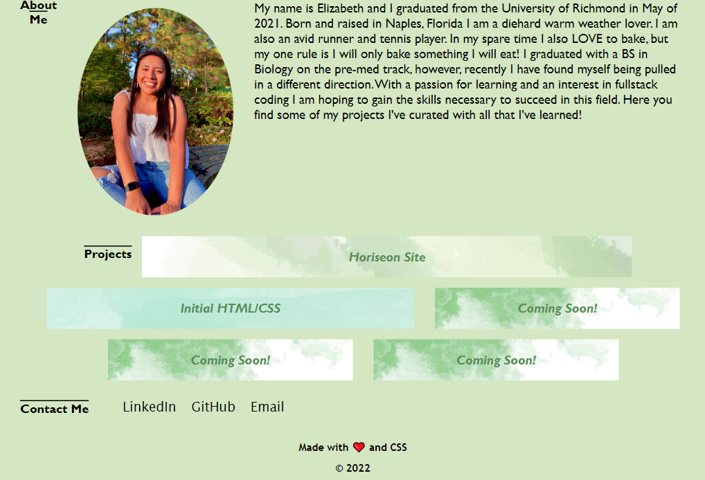

## ELL Portfolio

## Description
I wanted to create a central location, website, that featured information about myself and would hold examples of work I have been able to create. I want to give potential employers, friends, really anyone some insight into the skills and knowledge I posses that allowed me to create my portfolio. I have been able to take HTML, CSS, and 

## Installation

There is no installation required. You can access the webpage at https://elizabeth189.github.io/ELL-Portfolio/

## Usage

The [website](https://elizabeth189.github.io/ELL-Portfolio/) created allows you to learn more about Me by clicking on one of the headers located on the R side of the page. 

You can also scroll down on the webpage view my work. 

You can look through both the HTML and CSS files to check out how I created my portfolio!

## License

Please refer to the LICENSE in the repo.

---
